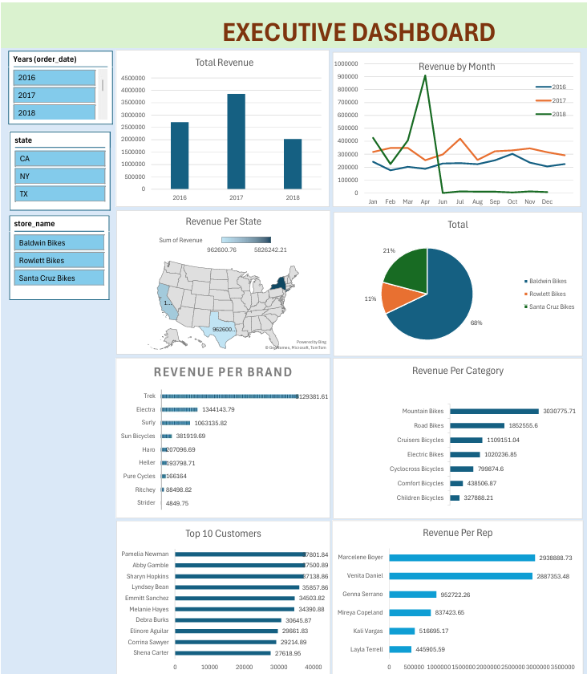

<h1 align="center">🚴‍♂️ Bike Sales Analytics — SQL • Excel • Tableau</h1>

  

  <b>End-to-end analytics project:</b> create + load BikeStores DB with SQL → prepare data for analysis → build an interactive Tableau dashboard → share executive report.

<h2>📁 Repository Contents</h2>
<ul>
  <li><code>BikeStores Database - create objects.sql</code> — builds BikeStores schema & tables</li>
  <li><code>BikeStores Sample Database - load data.sql</code> — inserts sample data</li>
  <li><code>BikeStores Sample Database - drop all objects.sql</code> — cleanup script</li>
  <li><code>bikesales-data-collecting-query.sql</code> — main analysis query (joins + aggregations)</li>
  <li><code>BikeSales-Project.xlsx</code> — Excel file used for checks/exports</li>
  <li><code>bikesales-dashboard.twb</code> — Tableau workbook</li>
  <li><code>Executive_dashboard.pdf</code> — exported executive report</li>
  <li><code>executive-dashboard.png</code> — dashboard preview image</li>
  <li><code>executive-dashboard-presentation.mp4</code> — short walkthrough (optional)</li>
</ul>

<h2>🎯 Project Overview</h2>

This project analyzes retail bike sales using the well-known <b>BikeStores</b> schema. It demonstrates:

<ul>
  <li>Data modeling & SQL scripting (DDL/DML)</li>
  <li>Analytical SQL (JOINs, GROUP BY, aggregation, calculated revenue)</li>
  <li>Executive-ready visualization and KPI storytelling in Tableau</li>
</ul>

<h2>🧱 Data Model (BikeStores)</h2>

Key tables used in analysis:

<ul>
  <li><b>sales.orders</b>, <b>sales.order_items</b></li>
  <li><b>sales.customers</b>, <b>sales.stores</b>, <b>sales.staffs</b></li>
  <li><b>production.products</b>, <b>production.categories</b>, <b>production.brands</b></li>
</ul>

<h2>🧮 Core Analysis Query</h2>

The main query aggregates units & revenue and enriches with product, category, brand, store, customer and salesperson context.

Show SQL

<pre>
SELECT 
    ord.order_id,
    CONCAT(cus.first_name, ' ', cus.last_name) AS customer,
    cus.city,
    cus.state,
    ord.order_date,
    SUM(ite.quantity) AS total_units,
    SUM(ite.quantity * ite.list_price) AS revenue,
    pro.product_name,
    cat.category_name,
    br.brand_name,
    st.store_name,
    CONCAT(sta.first_name,' ',sta.last_name) AS sales_rep
FROM sales.orders AS ord
JOIN sales.customers AS cus ON ord.customer_id = cus.customer_id
JOIN sales.order_items AS ite ON ord.order_id = ite.order_id
JOIN production.products AS pro ON pro.product_id = ite.product_id
JOIN production.categories AS cat ON cat.category_id = pro.category_id
JOIN production.brands AS br ON br.brand_id = pro.brand_id
JOIN sales.stores AS st ON st.store_id = ord.store_id
JOIN sales.staffs AS sta ON sta.staff_id = ord.staff_id
GROUP BY
    ord.order_id,
    CONCAT(cus.first_name, ' ', cus.last_name),
    cus.city,
    cus.state,
    ord.order_date,
    pro.product_name,
    cat.category_name,
    br.brand_name,
    st.store_name,
    CONCAT(sta.first_name,' ',sta.last_name);
</pre>

  ➜ See the exact file here:
  <a href="./bikesales-data-collecting-query.sql"><code>bikesales-data-collecting-query.sql</code></a>

<h2>📊 Dashboard Highlights</h2>
<ul>
  <li><b>Total Revenue & Units</b> with trend by month/year</li>
  <li><b>Revenue by State/Store</b> (regional performance)</li>
  <li><b>Top Brands/Categories/Products</b></li>
  <li><b>Sales Rep Performance</b> (who drives revenue)</li>
</ul>

  • Tableau workbook: <a href="./bikesales-dashboard.twb"><code>bikesales-dashboard.twb</code></a> 
  • PDF export: <a href="./Executive_dashboard.pdf"><code>Executive_dashboard.pdf</code></a>

<h2>⚙️ Quick Start</h2>
<ol>
  <li>Open SQL Server (SSMS) and run:
    <ul>
      <li><code>BikeStores Database - create objects.sql</code></li>
      <li><code>BikeStores Sample Database - load data.sql</code></li>
    </ul>
  </li>
  <li>Run <code>bikesales-data-collecting-query.sql</code> to produce the analytics result set.</li>
  <li>Open <code>bikesales-dashboard.twb</code> in Tableau Desktop (or Public) and connect to your dataset if prompted.</li>
  <li>Export or review the executive view (<code>Executive_dashboard.pdf</code>).</li>
</ol>

<h2>🧪 Validation (Excel)</h2>

Open <code>BikeSales-Project.xlsx</code> for quick spot checks (e.g., totals by month/state) to validate SQL and dashboard numbers.

<h2>🚀 What You’ll Learn</h2>
<ul>
  <li>Designing & initializing a relational schema for analytics</li>
  <li>End-to-end SQL for business-ready metrics (units, revenue)</li>
  <li>Building an executive dashboard with filters, KPIs & drilldowns</li>
</ul>

<h2>📽️ Optional Walkthrough</h2>

Watch the short presentation: <a href="./executive-dashboard-presentation.mp4"><code>executive-dashboard-presentation.mp4</code></a>

<h2>🙋 About</h2>

Created by <b>Sanjidul Alam Chowdhury</b> — Data Analyst (SQL • Excel • Tableau). 
📧 <a href="mailto:sanjidulshahin@gmail.com">sanjidulshahin@gmail.com</a> &nbsp;|&nbsp;
🔗 <a href="https://github.com/sanjidulshahin">GitHub</a>

⭐ If you find this useful, please star the repo!

